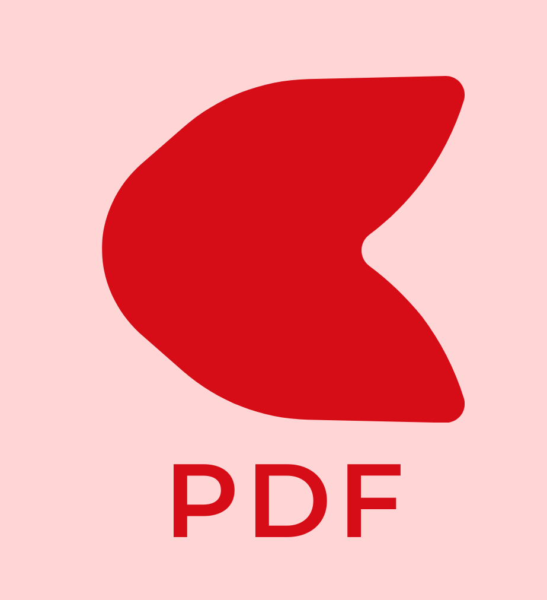
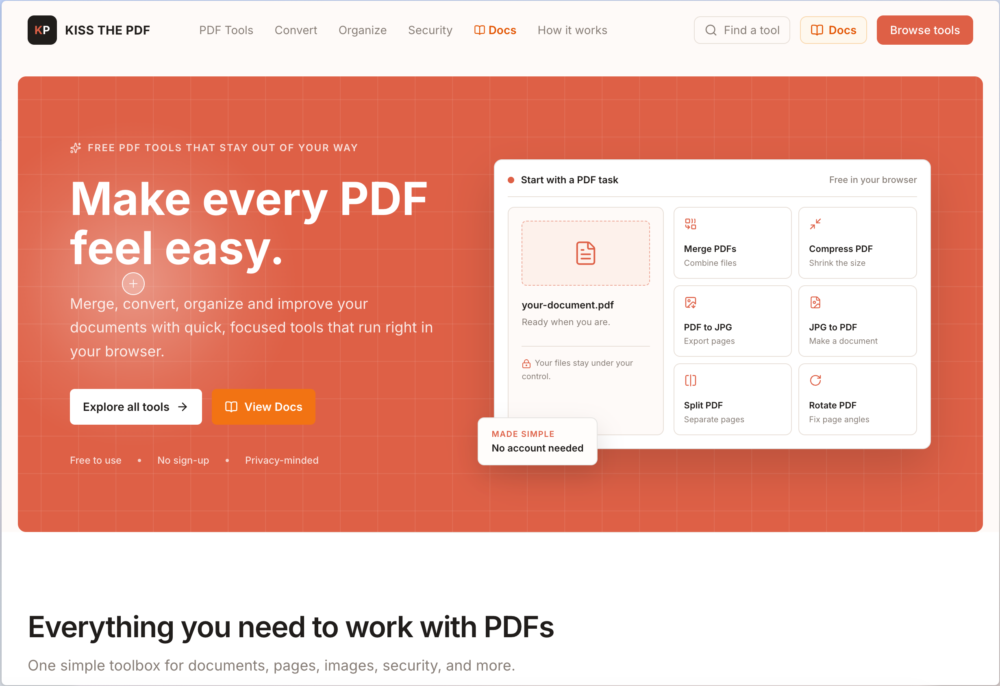

<div align="center">
  
  <h1>Kiss the PDF</h1>
  <p><strong>A free, open-source, privacy-first alternative to iLovePDF.</strong></p>
  <p>Kiss the PDF goodbye. Powerful document utilities right in your browser.</p>

  <p>
    <a href="https://kissthepdf.space/docs"><strong>📚 Read Documentation (/docs)</strong></a> •
    <a href="https://github.com/positiveabhii/kiss-the-pdf/issues"><strong>🐛 Issue Tracker</strong></a> •
    <a href="https://github.com/positiveabhii/kiss-the-pdf/issues/new?template=new_tool.yml"><strong>🛠️ Propose a Tool</strong></a> •
    <a href="CONTRIBUTING.md"><strong>🤝 Contributing</strong></a>
  </p>

  <br />

  <a href="https://kissthepdf.space">
    
  </a>
</div>

---

## 🌟 Philosophy

Our core philosophy is simple: **Your files belong to you.**

*   **Free and Open Source**: Everyone should have access to high-quality document tools. No paywalls.
*   **Privacy-First**: No mandatory accounts, no selling user data, no tracking.
*   **Local Processing**: Whenever technically possible, processing happens directly in your browser using Web Workers and WebAssembly (WASM). Your files never touch our servers.
*   **Fast and Accessible**: A minimal, fast user experience built with modern web standards, focusing on accessibility and responsive design.

## 📚 Documentation

Official user and developer documentation is available at **[kissthepdf.space/docs](https://kissthepdf.space/docs)**:

*   **[Getting Started](https://kissthepdf.space/docs/getting-started)**: Overview of KissThePDF tools and local file processing.
*   **[All 100 Tools Spec](https://kissthepdf.space/docs/tools)**: Technical specifications for every PDF utility.
*   **[Architecture](https://kissthepdf.space/docs/architecture)**: Deep dive into Next.js 16, TypeScript, pdf-lib, PDF.js, and Web Workers.
*   **[Development Setup](https://kissthepdf.space/docs/development)**: Setup instructions, build commands, and linting rules.

## 🏗️ Architecture

Built on a modern stack:
* Next.js 16+ (App Router & Turbopack)
* React 19 & TypeScript
* Tailwind CSS v4
* Client-Side PDF Engines (`pdf-lib`, `pdfjs-dist`, WebAssembly)

We strictly avoid unnecessary backend infrastructure. There is no database, Redis, or authentication layer. Everything is designed to be lightweight and frontend-first.

## 💻 Getting Started (Local Development)

```bash
# Clone the repository
git clone https://github.com/positiveabhii/kiss-the-pdf.git
cd kiss-the-pdf

# Install dependencies
npm install

# Run the development server
npm run dev
```

Open [http://localhost:3000](http://localhost:3000) with your browser to see the result.

## 🤝 Contributing & Submitting Issues

We want to build 100+ document utilities! We welcome community contributions.

*   Read our **[CONTRIBUTING.md](CONTRIBUTING.md)** for developer workflow details.
*   Open an issue using our structured **[GitHub Issue Forms](https://github.com/positiveabhii/kiss-the-pdf/issues/new/choose)**:
    *   [🐛 Bug Report](https://github.com/positiveabhii/kiss-the-pdf/issues/new?template=bug_report.yml)
    *   [✨ Feature Request](https://github.com/positiveabhii/kiss-the-pdf/issues/new?template=feature_request.yml)
    *   [🛠️ New PDF Tool Proposal](https://github.com/positiveabhii/kiss-the-pdf/issues/new?template=new_tool.yml)
    *   [🎨 UI / UX Issue](https://github.com/positiveabhii/kiss-the-pdf/issues/new?template=ui_ux.yml)
    *   [⚡ Performance Issue](https://github.com/positiveabhii/kiss-the-pdf/issues/new?template=performance.yml)
    *   [📚 Documentation Issue](https://github.com/positiveabhii/kiss-the-pdf/issues/new?template=documentation.yml)
    *   [❓ Question / Help](https://github.com/positiveabhii/kiss-the-pdf/issues/new?template=question.yml)

## 🛡️ Security

We take security seriously. Please review our **[SECURITY.md](SECURITY.md)** policy for privately reporting vulnerabilities via [GitHub Security Advisories](https://github.com/positiveabhii/kiss-the-pdf/security/advisories).

## 👨‍💻 Maintainer

Built and maintained by **Abhi**.

<a href="https://github.com/positiveabhii">
  
</a>

[@positiveabhii](https://github.com/positiveabhii)

## 📄 License

This project is licensed under the MIT License - see the [LICENSE](LICENSE) file for details.
